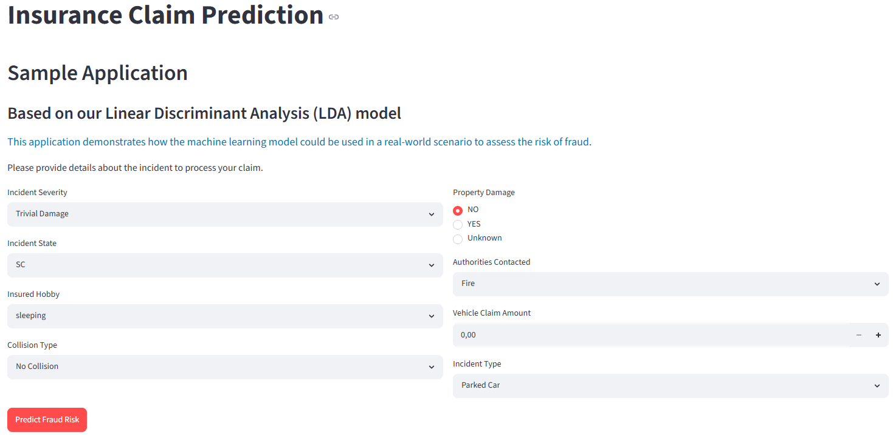
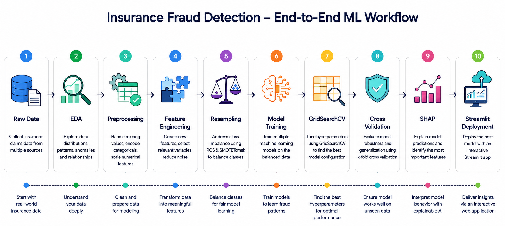

# 🛡️ Insurance Fraud Detection using Machine Learning

<p align="center">
  
</p>

<p align="center">
  <a href="https://fraudclaimpredict-crjkn5dvk8bzrvjubsnuad.streamlit.app/">
    
  </a>
</p>


# 🚀 Live Demo

👉 **https://fraudclaimpredict-crjkn5dvk8bzrvjubsnuad.streamlit.app/**

The deployed Streamlit application allows users to enter claim information and receive real-time fraud predictions generated by the trained machine learning pipeline.

<p align="center">
  
</p>

*Figure: Interactive Streamlit application for fraud prediction.*

# 📌 Project Overview

Insurance fraud causes substantial financial losses and inefficient claim investigations. This project develops interpretable machine learning models to identify potentially fraudulent claims from structured insurance data.

**Best Model:** Linear Discriminant Analysis + SMOTETomek  
**Best Weighted F1-score:** **0.84–0.85**  
**Cross-validation variance:** **0.0046**

# 📑 Table of Contents

1. [Business Problem](#1-business-problem)
2. [Dataset Overview](#2-dataset-overview)
3. [Machine Learning Workflow](#3-machine-learning-workflow)
4. [Data Preprocessing](#4-data-preprocessing)
5. [Statistical Analysis](#5-statistical-analysis)
6. [Class Imbalance Handling](#6-class-imbalance-handling)
7. [Model Performance](#7-model-performance)
8. [Model Explainability](#8-model-explainability)
9. [Key Insights](#9-key-insights)
10. [Project Achievements](#10-project-achievements)
11. [Tech Stack](#11-tech-stack)
12. [Repository Structure](#12-repository-structure)

# 1. Business Problem

Insurance fraud represents approximately **$14.9M** of **$52.2M** total claim volume in the dataset. Automatically identifying suspicious claims helps insurers reduce losses and optimize investigation resources.

# 2. Dataset Overview

| Attribute | Value |
|---|---:|
| Records | 1,000 |
| Features | 40 |
| Numerical Features | 18 |
| Categorical Features | 20 |
| Datetime Features | 2 |
| Fraud Cases | 24.7% |
| Country | USA |
| Period | Jan–Mar 2015 |

<p align="center">
  
</p>

*Figure: Dataset overview and feature distributions.*

# 3. Machine Learning Workflow

```text
Raw Data → EDA → Preprocessing → Feature Engineering → Resampling → Model Training → GridSearchCV → Cross Validation → SHAP → Streamlit Deployment
```

<p align="center">
  
</p>

*Figure: End-to-end machine learning workflow.*

# 4. Data Preprocessing

- **Missing value imputation:** Missing values in `authorities_contacted` were imputed because removing nearly 10% of the dataset would reduce valuable information.
- **Handling '?' values:** Ambiguous values were replaced with `Unknown` or `No Collision` to avoid leakage and preserve context.
- **One-Hot Encoding:** Chosen because ordinal encoding reduced model performance by imposing artificial numerical distances.
- **MinMax Scaling:** Applied because most numerical features were not normally distributed.
- **Feature reduction:** Statistical tests and heatmaps reduced multicollinearity and retained only informative variables.

# 5. Statistical Analysis

Methods applied:

- Chi² Test
- Cramér's V
- SelectKBest
- Correlation Heatmap

The feature `vehicle_claim` was retained because it showed the strongest statistical relevance while avoiding redundancy with correlated claim variables.

<p align="center">
  
</p>

*Figure: Correlation heatmap of quantitative variables.*

<p align="center">
  
</p>

*Figure: Feature importance analysis.*

# 6. Class Imbalance Handling

Random undersampling was discarded because the dataset is relatively small. Oversampling preserves information while improving minority class representation.

| Method | Fraud | Non-Fraud |
|---|---:|---:|
| Original | 192 | 608 |
| ROS | 608 | 608 |
| SMOTETomek | 605 | 605 |

SMOTETomek combines synthetic sample generation with noise removal, helping models learn clearer decision boundaries.

<p align="center">
  
</p>

*Figure: Class imbalance before and after resampling.*

# 7. Model Performance

| Model | Initial | ROS | SMOTETomek |
|---|---:|---:|---:|
| Logistic Regression | 0.83 | 0.85 | 0.84 |
| SVC | 0.80 | 0.84 | 0.83 |
| Ridge Classifier | 0.85 | 0.84 | 0.84 |
| LDA | 0.84 | 0.84 | 0.84 |

Although Random Forest and XGBoost achieved perfect training scores, they exhibited strong overfitting. Linear models generalized better on unseen data.

LDA + SMOTETomek was selected because it achieved high performance with low variance across 50-fold cross-validation.

<p align="center">
  
</p>

*Figure: Model performance comparison.*

# 8. Model Explainability

SHAP (SHapley Additive exPlanations) was used to quantify how features influence predictions and improve model transparency.

## Key Fraud Indicators

- **incident_severity_Major_Damage**
  - Ranked first across all models.
  - High-value claims likely attract greater scrutiny and fraud incentives.

- **insured_hobbies_chess**
  - Consistently appeared among top predictors.
  - Represents statistical correlation in the dataset rather than causation.

- **insured_hobbies_crossfit**
  - Frequently ranked among influential features.
  - Behavioral variables should be interpreted cautiously.

<p align="center">
  
</p>

*Figure: SHAP explanation for LDA predictions.*

# 9. Key Insights

✅ Major damage is the strongest fraud predictor.

✅ Linear models generalized better than tree-based models.

✅ SMOTETomek improved robustness and class separation.

✅ One-Hot Encoding outperformed ordinal encoding.

# 10. Project Achievements

✅ Built an end-to-end machine learning pipeline

✅ Achieved weighted F1-score up to **0.85**

✅ Applied ROS and SMOTETomek resampling

✅ Validated robustness with **50-fold cross-validation**

✅ Implemented SHAP explainability

✅ Deployed a live Streamlit application

# 11. Tech Stack

Python • Pandas • NumPy • Scikit-Learn • Imbalanced-Learn • SHAP • Streamlit • Matplotlib

# 12. Repository Structure

```text
claim_predict/
├── backup/
├── images/
├── data_exploration.ipynb
├── Modelling.ipynb
├── insurance_claims.csv
├── requirements.txt
└── README.md
```
